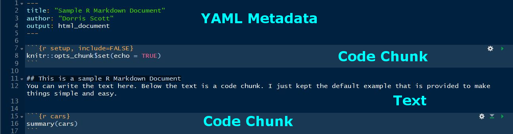

```{r setup, include=FALSE}
options(htmltools.dir.version = FALSE)
```


# Workshop Objectives

- To have a basic understanding of the R Markdown framework.

- To gain familarity with R blogdown to create a personal site.

- To understand how to deploy your personal site using Netlify.

FYI: This presentation was made with R Markdown!
---

# Difficulty Level

- Beginner to lower intermediate.

- You should have some experience with R.

- Having experience with GitHub will be useful!

---

class: inverse, center, middle

# First things first!

###  [**Click Here**](https://github.com/momiji15/yearntolearn/tree/master/RLadies_STL) for materials!

---

#First things first!

In your console, install the rmarkdown and blogdown packages and load them:

```{r, chunk-one, echo = TRUE, eval = FALSE}
install.packages("rmarkdown")
install.packages("blogdown")
library(rmarkdown)
library(blogdown)
```

If you are getting error messages about packages missing then:

```{r, chunk-one extra, echo = TRUE, eval = FALSE}
install.packages("rmarkdown", dependencies = TRUE)
install.packages("blogdown", dependencies = TRUE)
library(rmarkdown)
library(blogdown)
```

---

class: inverse, center, middle

# Making an R Markdown Document


---


# Creating an R Markdown Document

To keep things organized, please create a folder and name it **rmarkdown_rladiesstl**.

Please create your folder in a location where you can easily find it.

---


# Creating an R Markdown Document




---


# Knowledge Check!

What would be the correct markdown to add a Header 1 to “Title”?

a. `**Title**`

b. `# Title`

c. `* Title`

d. `## Title` 


---


# Knowledge Check!

What would be the correct markdown to add a Header 1 to “Title”?

a. `**Title**`

**b. `# Title` **

c. `* Title`

d. `## Title` 


---


# Creating an R Markdown Document

## Exercise 1
Make a basic R Markdown document with these components:
- Name

- Short biography

- Interests 

- Education

- Hobbies


---

# Creating an R Markdown Document

Make sure to refer to [Unit 1](https://github.com/momiji15/yearntolearn/blob/master/RLadies_STL/R_Markdown_Tutorial/Unit1.md) and the R Markdown [About Me](https://github.com/momiji15/yearntolearn/blob/master/RLadies_STL/R_Markdown_Tutorial/aboutmetemplate.md) template to help you make your document. Once you are done creating your document, press the **Knit** button!

---

class: inverse, center, middle

# Making a Personal Website with Blogdown


---


# Making a Personal Website with Blogdown

## Background
- Created by [Yihui Xue](https://yihui.name/) and [contributors](https://cran.r-project.org/web/packages/blogdown/index.html).

- Used to make static websites.

- Uses R Markdown! 


---

# Making a Personal Website with Blogdown

## Pros
- You don't need to know HTML or CSS!
- Plenty of free static themes to choose from.
- Deployment doesn't have to cost a thing!

## Cons
- You might need to have some familiarity with GitHub depending on the deployment option.
- Not all Hugo themes mesh well with blogdown.
- File structure of the themes can be tricky.

---

# Making a Personal Website with Blogdown

Basic Steps

1. Find a [Hugo theme](https://themes.gohugo.io/) you want to use.

2. Generate blogdown site using your chosen theme in RStudio.

3. Deploy your site!


---

# Making a Personal Website with Blogdown

## Blogdown sites I've made

- [My personal site](https://dscott.netlify.com/) which uses the  [Introduction](https://themes.gohugo.io/hugo-theme-introduction/) theme.

- [HER Map](https://hermap.netlify.com/) which uses the [Kubo](https://themes.gohugo.io/kube/) theme.


---


# Knowledge Check!

Fill in the blanks to create a new site with the Academic theme.

 `blogdown::_______(theme = "_________")`
 

---


# Knowledge Check!

Fill in the blanks to create a new site with the Academic theme.

 `blogdown::`**`new_site`**`(theme = `**`"gcushen/hugo-academic"`**`)`
 

---


# Making a Personal Website with Blogdown

## Exercise 2


It's time to build your personal website using a theme of your choice! Refer to [Unit 2, Lessons 1 and 2](https://github.com/momiji15/yearntolearn/blob/master/RLadies_STL/R_Markdown_Tutorial/Unit2.md) for instructions on how to build your personal website.


---

class: inverse, center, middle

# Deploying Your Site


---

# Deploying Your Site

Many options!
- Netlify

- Updog

- GitHub pages

- Travis + GitHub

- GitLab pages


---

# Knowledge Check!

Which folder do you have to add to Netlify to deploy your site?

 a. themes
 
 b. static
 
 c. content
 
 d. public
 

---


# Knowledge Check!

Which folder do you have to add to Netlify to deploy your site?

 a. themes
 
 b. static
 
 c. content
 
 **d. public**
 

---

# Deploying Your Site with Netlify

##  Exercise 3 
- If you are finished with Exercise 2, go ahead and deploy your site! Refer back to [Unit 2, Lesson 3](https://github.com/momiji15/yearntolearn/blob/master/R%20Markdown%20Tutorial/Unit%202.md) for instructions.


---

class: inverse, middle, center

# Questions?